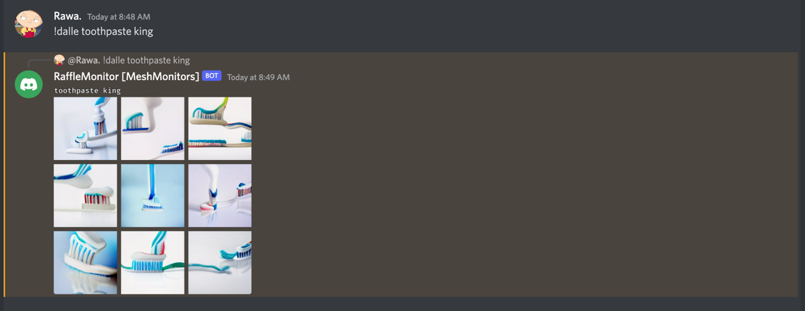

[](https://postimg.cc/TpGJwp0j)

[DALL·E Mini][]
===================
[](https://www.python.org/downloads/)


[md-pypi]: https://pypi.org/project/Markdown/
[pyversion-button]: https://img.shields.io/pypi/pyversions/Markdown.svg

DALL·E mini as a discord bot. Use `!help` to see the commands.

- You can deploy the bot to heroku as a starting point.
- Fill out `data.yaml` and configure the bot.

[DALL·E Mini]: https://github.com/borisdayma/dalle-mini
[Sentry's]: https://sentry.io/

[Markdown]: https://daringfireball.net/projects/markdown/
[Features]: https://Python-Markdown.github.io#Features
[Available Extensions]: https://Python-Markdown.github.io/extensions

Docker installation
-------------

Add your bot token to the docker-compose.yml file (this will override the bot token in data.yaml), then build and run with docker-compose:

```
docker-compose build
docker-compose up -d
```

How to use?
-------------


```text
# Pretty simple. Just call the command 

!dalle <query> 
e.g: !dalle Cats just won the super bown
```


That's it!

Example (thanks to @Cosmin96 for the collage):

[](https://postimg.cc/TpGJwp0j)

Support
----
You may report bugs, ask for help, and discuss various other issues on the issues page.
Discord: Rawa.#7438

Change Log
----------
Version 1.0.1:
  - Images are sent in a collage.
  - Cleanup for collage added.

Version 1.0.0:
  - Initial release.
